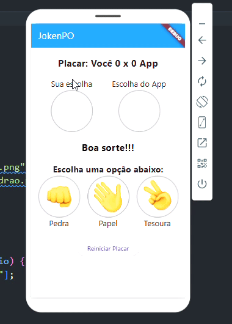

# JokenPo Flutter

## 📌 Sobre o Projeto
Este é um jogo de Pedra, Papel e Tesoura desenvolvido em Flutter. O jogo permite ao usuário jogar contra a IA, exibindo as escolhas na tela e mantendo um placar de vitórias.

## 🚀 Funcionalidades
- Exibe a escolha do usuário e da IA.
- Contabiliza a pontuação de ambos os jogadores.
- Indica o vencedor da rodada com cores distintas para facilitar a identificação.
- Permite reiniciar o placar.

## 🛠 Tecnologias Utilizadas
- Flutter
- Dart

## 🎨 Melhorias na Usabilidade
- Adição de placar para acompanhar as vitórias.
- Feedback visual colorido para indicar vitória, derrota ou empate.
- Nome das opções abaixo das imagens para melhor identificação.
- Botão para reiniciar o placar.

## 📷 Imagens do Projeto



## 🔧 Como Executar
1. Clone o repositório:
   ```sh
   git clone https://github.com/thalesleall/dev_mob_jocken-po.git
   ```
2. Navegue até a pasta do projeto:
   ```sh
   cd jokenpo-flutter
   ```
3. Instale as dependências:
   ```sh
   flutter pub get
   ```
4. Execute o aplicativo:
   ```sh
   flutter run
   ```


## 📄 Licença
Este projeto está sob a licença MIT. Sinta-se livre para usá-lo e modificá-lo.

## 🤝 Contribuição
Se quiser contribuir com melhorias, sinta-se à vontade para abrir um PR ou relatar issues!

---
Desenvolvido com ❤️ usando Flutter.

